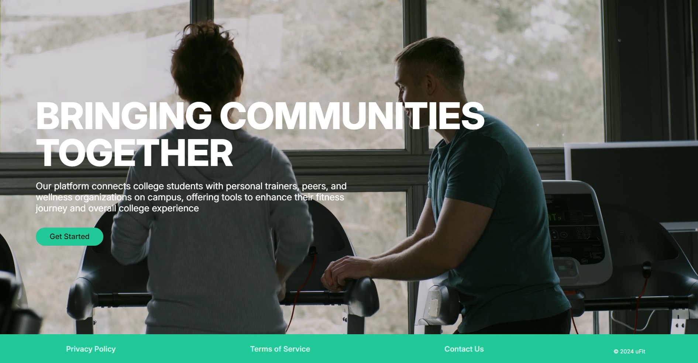
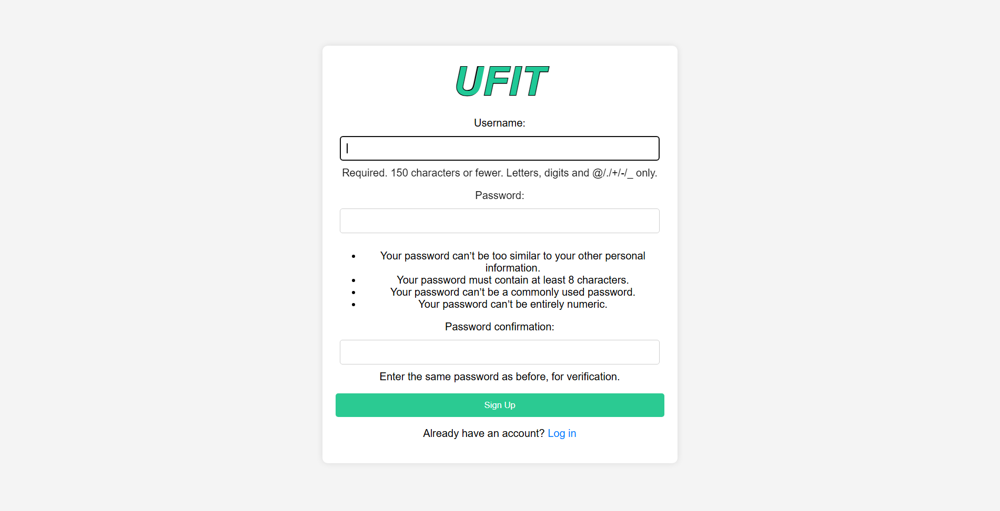
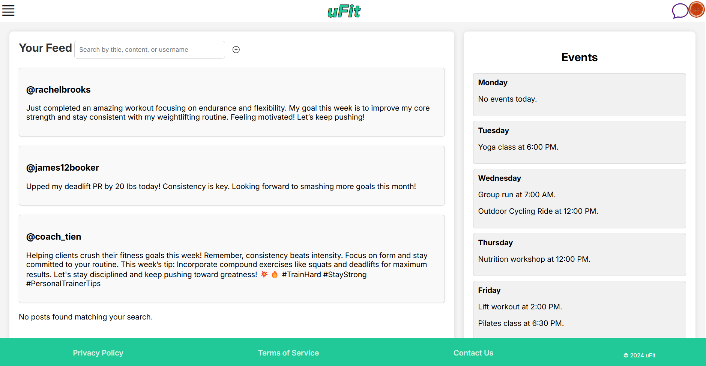

# 🏋️‍♂️ UFIT - Fitness & Wellness Platform  

Welcome to **UFIT**, a web-based platform designed to help college students maintain a balanced and healthy lifestyle through personal trainer interaction, peer support, and access to wellness resources.  

---

## 📋 Table of Contents  
- [Project Overview](#project-overview)  
- [Features](#features)  
- [Tech Stack](#tech-stack)  
- [Installation](#installation)  
- [Project Structure](#project-structure)  
- [Key Functionalities](#key-functionalities)  
- [Screenshots](#screenshots)  
- [Future Improvements](#future-improvements)  
- [License](#license)  

---

## 🧭 Project Overview  

**UFIT** connects college students with personal trainers, wellness organizations, and peer workout groups at their campus. The platform supports connecting with fitness communities through posts, events, and global messaging.  

---

## 🛠️ Features  

### **User Roles**  
- 👨‍🎓 **Student:** Access fitness events, personal trainers, and wellness programs.  
- 🏋️ **Trainer:** Create personalized workout programs and offer coaching.  
- 🏥 **Wellness Organization:** Promote campus events and health services.  

### **Core Functionalities**  
- 📢 **Post Feed:** Share workout updates, achievements, and fitness tips.  
- 🔍 **Search & Filters:** Search posts by username, title, or content.  
- ➕ **Create Post:** Share progress and experiences with the community.  
- 📅 **Event Calendar:** Discover and join fitness events on campus.  
- 💬 **Messaging:** Connect with personal trainers, peers, and organizations.  

---

## ⚙️ Tech Stack  

- **Backend:** Django 5.1.3, Python 3.12.8  
- **Frontend:** HTML5, CSS3, JavaScript (AJAX)  
- **Database:** SQLite (Development), PostgreSQL (Production)  
- **Version Control:** Git & GitHub  

---

## 🚀 Installation  

### 1. Clone the Repository:  
```bash
git clone https://github.com/yourusername/ufit.git
cd ufit
```


### 2. Create a Virtual Environment:
```bash
python -m venv venv
source venv/bin/activate  # Mac/Linux
venv\Scripts\activate     # Windows
```

### 3. Install Requirements:
```bash
pip install -r requirements.txt
```

### 4. Apply Migrations:
```bash
python manage.py makemigrations
python manage.py migrate
```

### 5. Run the Development Server:
```bash
python manage.py runserver
```


## 💻 Key Functionalities  

1. **Registration & Authentication**  
   - Custom user profiles and secure logins.  

2. **Post Feed & Search**  
   - Create, view, and edit posts.  
   - AJAX-powered live search by username, post title, or content.  

3. **Personal Trainers & Organizations**  
   - Search and connect with trainers and wellness organizations.  

4. **Event Calendar**  
   - Weekly events featuring fitness classes, training sessions, and wellness workshops.  

5. **Messaging System**  
   - In-app messaging between students, trainers, and organizations.  

---

## 📸 Screenshots  
 
 
 

---

## 🔮 Future Improvements  

- 📲 **Mobile App Version:** Progressive Web App (PWA).  
- 📈 **Fitness Analytics:** Progress tracking.
- 📅 **Event RSVP System:** Notifications and attendance tracking.  

